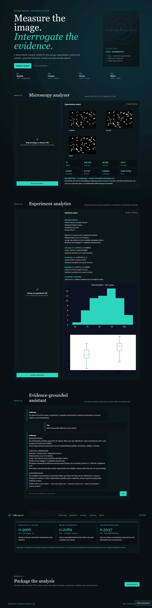

# CellScope AI

**Agentic Research Copilot for Cellular and Organ-on-a-Chip Analysis**  
AI4S Open Innovation: AI for Life Science - End-to-End System category

CellScope AI turns microscopy images and experiment tables into inspectable measurements, statistical observations, cited research context, and portable reports. It is a research support system, not a medical diagnostic product.



## Problem and solution

Cellular experiments often fragment image processing, statistics, literature review, and reporting across disconnected tools. CellScope combines them while retaining structured intermediate results and separating:

- **Measured results** from the deterministic microscopy pipeline.
- **Statistical observations** from uploaded experiment tables.
- **Retrieved evidence** from a curated offline source index.
- **AI interpretation** as clearly labeled, evidence-bounded hypotheses and next steps.

No paid API or LLM key is required. Unsupported questions produce an evidence limitation rather than invented citations.

## Key features

- PNG/JPEG/TIFF analysis with max-RGB Otsu foreground detection, morphology, marker-controlled watershed, and region properties.
- Original image, binary mask, overlay, count, area, perimeter, circularity, eccentricity, intensity, density, and focus measurements.
- CSV schema inference, missing-data audit, descriptive statistics, Mann-Whitney U, Cohen's d, Spearman correlation, anomaly candidates, and charts.
- Deterministic state-graph orchestration across image context, experiment context, retrieval, interpretation, and response composition.
- Offline TF-IDF retrieval with title, URL, section metadata, score thresholding, and unsupported-answer handling.
- Self-contained HTML reports with visual results, methods, findings, limitations, and references.
- FastAPI validation, bounded uploads, safe filenames, tests, Docker configuration, and a responsive framework-free frontend.

## Architecture

```text
HTML/CSS/JavaScript dashboard
              |
              v
       FastAPI + Pydantic
              |
    +---------+----------+----------------+
    |         |          |                |
    v         v          v                v
 Vision   CSV analytics  Offline RAG  Report generator
    |         |          |                ^
    +---------+------> deterministic state graph
                          |
         measured result / statistical observation /
         retrieved evidence / AI interpretation
```

## Microscopy method: frozen CellScope v2

The exact production configuration is in [`evaluation/cellscope_v2_config.json`](evaluation/cellscope_v2_config.json). It uses per-pixel maximum RGB signal, global Otsu thresholding, 72-pixel object/hole filtering, disk-1 opening, Euclidean distance transform, 16-pixel peak spacing, and marker-controlled watershed. Parameters were selected only on BBBC031 development wells and are frozen as version 2.0.0.

## Evaluation

### Synthetic regression vs BBBC031 vs external real microscopy

| Metric | Regression fixture | BBBC031 held-out | BBBC008 real microscopy |
|---|---:|---:|---:|
| Images | 1 | 162 | 12 |
| Role | Software check | Simulated in-domain test | External domain-shift test |
| Dice | 1.000000 | **0.996559** | **0.228931** |
| IoU | 1.000000 | **0.993151** | **0.131833** |
| Foreground precision | Not recorded | 0.999901 | 0.999711 |
| Foreground recall | Not recorded | 0.993248 | 0.131836 |
| Count MAE | 0 | 0.3951 | Not supported |
| Count RMSE | Not calculated | 0.6939 | Not supported |

The BBBC031 result is strong but in-domain and simulated. Unchanged v2 performs poorly on real BBBC008 imagery because bright Hoechst nuclei dominate dim, variable actin cytoplasm: prediction covers 4.0% of pixels versus 28.7% ground truth. This is evidence of limited external generalization, not a result to hide.

A post-hoc per-channel normalization experiment improved BBBC008 Dice to 0.5037, but used the same 12 images, remained inadequate, and was **not** promoted into production.

- [BBBC031 protocol and results](evaluation/BBBC031_RESULTS.md)
- [BBBC008 external validation](evaluation/EXTERNAL_VALIDATION.md)
- [Generalization scorecard](evaluation/GENERALIZATION.md)
- [External dataset documentation](docs/EXTERNAL_VALIDATION_DATASET.md)


## Datasets and licenses

- **BBBC031 v1:** 216 simulated RGB fluorescence images with cell/nucleus masks and 8,640 annotations; CC BY 3.0. Source: <https://bbbc.broadinstitute.org/BBBC031>.
- **BBBC008 v1:** 12 real HT29 fluorescence fields with Hoechst and phalloidin channels and cleaned foreground masks; CC BY-NC-SA 3.0. Source: <https://bbbc.broadinstitute.org/BBBC008>.

Source datasets are ignored by Git and downloaded from official URLs. Their original licenses remain controlling.

## Install and run

Python 3.11 or 3.12 is recommended.

```bash
python -m venv .venv
# Windows: .venv\Scripts\activate
# macOS/Linux: source .venv/bin/activate
python -m pip install -r requirements.txt
python scripts/generate_sample_data.py
python -m uvicorn backend.app.main:app --reload
```

Open <http://127.0.0.1:8000>. OpenAPI documentation is at <http://127.0.0.1:8000/docs>.

### Docker

```bash
docker compose up --build
```

The image and Compose configuration were built successfully on Docker Desktop 29.7.2. A container started as the non-root `cellscope` user and returned the expected `/health` response; the Compose service also uses a read-only filesystem, temporary `/tmp`, and `no-new-privileges`.

## API examples

```bash
curl http://127.0.0.1:8000/health
curl -F "file=@data/sample/synthetic_cells.png" http://127.0.0.1:8000/api/images/analyze
curl -F "file=@data/sample/experiment.csv" http://127.0.0.1:8000/api/experiments/analyze
curl -H "Content-Type: application/json" -d '{"question":"What evidence supports this method?"}' http://127.0.0.1:8000/api/chat
```

## Reproduce evaluation

```bash
# Software regression and RAG
python evaluation/run_evaluation.py
python evaluation/evaluate_rag.py

# BBBC031
python scripts/download_bbbc031.py
python evaluation/bbbc031_benchmark.py --stage baseline
python evaluation/bbbc031_benchmark.py --stage tune
python evaluation/bbbc031_benchmark.py --stage final

# External BBBC008
python scripts/download_bbbc008.py
python evaluation/external_validation.py --stage frozen
python evaluation/external_validation.py --stage generalization
python evaluation/generate_external_artifacts.py

# Tests
python -m pytest -q
```

## Repository structure

```text
backend/app/         FastAPI, analysis, workflow, RAG, and reports
frontend/            linked HTML, CSS, and JavaScript; no build step
data/sample/         deterministic demonstration inputs
evaluation/          protocols, runners, machine results, scorecards
reports/             representative screenshots and error artifacts
scripts/             dataset download and sample generation
tests/               API, analysis, workflow, and utility tests
docs/                technical report, writeup, dataset notes, demo script
```

## Reliability, safety, and limitations

- Uploaded content is size-bounded, decoded or parsed rather than executed, and not persisted by the API.
- A segmented object is not guaranteed to represent one biological cell. Pixel units are not physical units without calibration.
- Global thresholding remains vulnerable to intensity shift, uneven illumination, scale changes, blur, dense touching cells, and modality differences.
- Statistical tests are exploratory and unadjusted for multiple testing; correlations are not causal evidence.
- Isolation Forest identifies review candidates, not biological abnormalities.
- The knowledge base is deliberately small. Retrieval evidence may be insufficient.
- PDF export and a pretrained segmentation model are not included; reliable HTML export is supported.
- No organ-on-a-chip dataset, patient cohort, clinical endpoint, drug-efficacy model, or toxicity model has been validated.

## Competition materials

- [Technical report](docs/TECHNICAL_REPORT.md)
- [Kaggle writeup](docs/KAGGLE_WRITEUP.md)
- [Five-minute demo script](docs/DEMO_VIDEO_SCRIPT.md)
- [Competition audit](docs/COMPETITION_AUDIT.md)
- [BBBC031 dataset interpretation](docs/BBBC031_DATASET.md)
- [External dataset documentation](docs/EXTERNAL_VALIDATION_DATASET.md)

## License and citation

CellScope source code is MIT licensed. External datasets retain their original terms. See [`CITATION.cff`](CITATION.cff) and the technical report references. Add the public repository URL to the competition write-up before publication.
